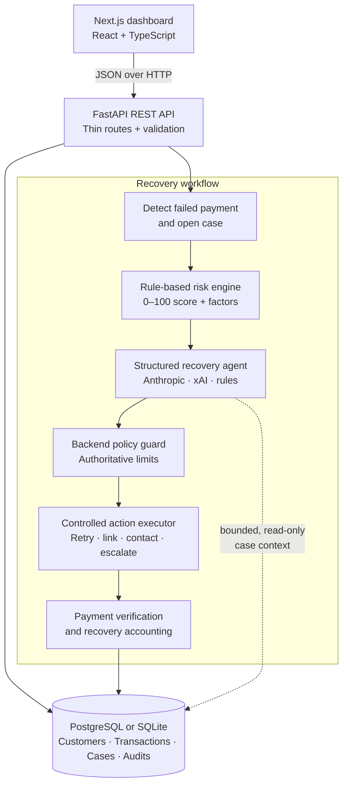

# RevenueRecover AI

RevenueRecover AI is a full-stack revenue-operations demo that identifies failed payments, opens recovery cases, calculates deterministic risk, obtains a structured recovery recommendation, enforces policy, and records verified recovered revenue.

It is deliberately **not a chatbot**. AI is a constrained decision layer inside a backend-controlled workflow: it can inspect a bounded, case-specific context and propose an action, but it cannot directly charge a customer or send communications.

## Highlights

- Simulate successful or failed customer payments.
- Automatically create and risk-score recovery cases for failed payments.
- Use deterministic, explainable risk scoring with a score from 0–100.
- Run a structured recovery agent using Anthropic, xAI/Grok, or the offline `rules` provider.
- Enforce backend policy for retry limits, reminders, cooldowns, high-value cases, scheduling, and terminal states.
- Execute controlled recovery actions and simulate a verified customer payment.
- Track dashboard metrics, recovery status, and a durable audit trail.
- Run locally with SQLite, or PostgreSQL via Docker Compose.

> **Demo scope:** payment processing and recovery actions are simulated. This repository does not make live Razorpay, Stripe, email, or WhatsApp calls.

## Architecture



### Recovery lifecycle

```text
Failed payment
  → detect revenue at risk
  → open and score recovery case
  → agent diagnoses and recommends one action
  → backend validates policy and executes or blocks it
  → customer payment is simulated and verified
  → recovered revenue and audit history are updated
```

### Safety model

The agent proposes; the backend decides and executes. Provider outputs are schema-validated, scoped to the active case, and checked against policy before any effect occurs. Policy limits include maximum retries and reminders, customer-contact cooldowns, scheduling rules, high-value thresholds, and terminal case states. Every detection, decision, approval, block, action, and payment outcome is written to the audit trail.

## Technology

| Area | Implementation |
|---|---|
| Frontend | Next.js 16, React 19, TypeScript, Lucide |
| Backend | Python, FastAPI, Pydantic, SQLAlchemy |
| Database | SQLite for local demos; PostgreSQL for Docker-backed development |
| Migrations | Alembic |
| AI providers | Anthropic, xAI/Grok, or deterministic offline rules |
| Testing | Pytest |

## Repository layout

```text
.
├── backend/
│   ├── app/
│   │   ├── agents/          # Provider abstraction and structured decisions
│   │   ├── api/             # FastAPI routes
│   │   ├── models/          # SQLAlchemy entities and enums
│   │   ├── risk/            # Deterministic risk scoring
│   │   ├── services/        # Domain services and audit logging
│   │   ├── simulations/     # Demo seed data
│   │   └── workflow/        # Policy guard and recovery state machine
│   ├── alembic/             # Schema migrations
│   └── tests/               # Backend tests
├── frontend/                # Next.js App Router dashboard
├── docs/PRD.md              # Product requirements and project context
├── .env.example             # Backend environment template
└── docker-compose.yml       # Optional local PostgreSQL service
```

## Quick start

### Prerequisites

- Python 3.14 or a compatible Python version
- Node.js and npm
- Docker Desktop (optional, required only for the PostgreSQL route)

### 1. Configure the backend

From the repository root, create your local environment file:

```powershell
Copy-Item .env.example .env
```

For a fully offline, zero-infrastructure demo, edit `.env` to use:

```env
DATABASE_URL=sqlite+pysqlite:///./revenuerecover.db
AI_PROVIDER=rules
```

Do not commit `.env`; it can contain real database credentials and AI provider keys. Keep `.env.example` limited to safe placeholders or local development defaults.

### 2. Install backend dependencies

```powershell
python -m venv .venv
.venv\Scripts\Activate.ps1
python -m pip install -r backend\requirements.txt
```

### 3. Create the schema and demo data

Use migrations for the normal local setup:

```powershell
Set-Location backend
python -m alembic upgrade head
python manage.py seed
```

`seed` resets the demo dataset and loads sample customers and historical transactions.

### 4. Start the API

In a terminal from `backend/`:

```powershell
python -m uvicorn app.main:app --reload --port 8000
```

The API is available at <http://localhost:8000>, with interactive OpenAPI documentation at <http://localhost:8000/docs>.

### 5. Install and run the frontend

In a separate terminal:

```powershell
Set-Location frontend
Copy-Item .env.local.example .env.local
npm install
npm run dev
```

Open <http://localhost:3000>. The default frontend configuration expects the API at `http://localhost:8000`.

## Optional: PostgreSQL with Docker

The Compose file runs PostgreSQL only; the backend and frontend continue to run directly on your machine.

```powershell
docker compose up -d
docker compose exec postgres pg_isready -U revenue -d revenuerecover
```

Use the PostgreSQL `DATABASE_URL` already shown in `.env.example`, then run the migration and seed commands from the quick-start section.

To stop the database:

```powershell
docker compose down
```

## Demo workflow

1. Seed the sample data with `python manage.py seed`.
2. Open the dashboard and create a failed payment in the payment simulator.
3. A recovery case is automatically created and given a deterministic risk score.
4. Open that case and run the recovery agent. `AI_PROVIDER=rules` works without an API key.
5. Execute the validated recommendation.
6. Simulate the follow-up customer payment and inspect the case audit trail.

Amounts in API requests and persisted records are integer **paise**. For example, `299900` represents ₹2,999.00.

## API overview

All application routes are under `/api` unless noted otherwise.

| Area | Endpoints |
|---|---|
| Health | `GET /health` |
| Dashboard | `GET /api/dashboard` |
| Customers | `GET`, `POST /api/customers`; `GET /api/customers/{customer_id}` |
| Transactions | `GET /api/transactions`; `GET /api/transactions/{transaction_id}` |
| Payment simulation | `POST /api/payments/simulate` |
| Recovery cases | `GET /api/recovery-cases`; `GET /api/recovery-cases/{case_id}` |
| Agent and actions | `POST /api/recovery-cases/{case_id}/run-agent`; `POST /api/recovery-cases/{case_id}/execute` |
| Recovery verification | `POST /api/recovery-cases/{case_id}/simulate-payment` |
| Audit activity | `GET /api/agent/actions` |
| Demo controls | `POST /api/demo/seed`; `POST /api/demo/reset`; `DELETE /api/demo/data` |

### API example

Create a failed payment for an existing seeded customer:

```powershell
curl.exe -X POST http://localhost:8000/api/payments/simulate `
  -H "Content-Type: application/json" `
  -d '{"customer_id":1,"amount":299900,"succeed":false,"failure_reason":"expired_card"}'
```

Then run the agent and execute its persisted recommendation for the returned case ID:

```powershell
curl.exe -X POST http://localhost:8000/api/recovery-cases/1/run-agent
curl.exe -X POST http://localhost:8000/api/recovery-cases/1/execute `
  -H "Content-Type: application/json" `
  -d '{}'
```

Finally, simulate a successful customer payment:

```powershell
curl.exe -X POST http://localhost:8000/api/recovery-cases/1/simulate-payment `
  -H "Content-Type: application/json" `
  -d '{"succeed":true}'
```

## Environment variables

| Variable | Purpose |
|---|---|
| `DATABASE_URL` | SQLite or PostgreSQL SQLAlchemy connection URL |
| `AI_PROVIDER` | `anthropic`, `xai`/`grok`, or `rules` |
| `ANTHROPIC_API_KEY` | Secret key for the Anthropic provider; keep only in `.env` |
| `XAI_API_KEY` | Secret key for the xAI provider; keep only in `.env` |
| `AGENT_MODEL` | Optional provider-model override |
| `CORS_ORIGINS` | Comma-separated allowed frontend origins |
| `NEXT_PUBLIC_API_BASE_URL` | Frontend API base URL; configured in `frontend/.env.local` |
| `MAX_PAYMENT_RETRIES` | Backend retry limit |
| `MAX_REMINDERS` | Backend reminder limit |
| `CONTACT_COOLDOWN_HOURS` | Minimum interval between contact actions |

See [`.env.example`](.env.example) for the complete local configuration template.

## Validation and tests

Run backend tests from `backend/`:

```powershell
python -m pytest -v
```

Run frontend checks from `frontend/`:

```powershell
npm run lint
npm run typecheck
npm run build
```

## Development notes

- The frontend renders API state and does not calculate risk, money, or recovery eligibility.
- Risk scoring is deterministic and explainable; it is not represented as ML-based scoring.
- The `rules` provider is the recommended default for repeatable offline demos.
- The API is designed for local demonstration and does not include authentication or authorization. Do not expose it publicly with real credentials or customer data.

## Further documentation

See [docs/PRD.md](docs/PRD.md) for the project requirements, workflow rationale, and planned scope.
